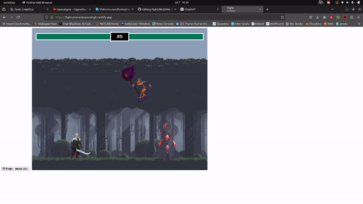

# Simple Fighting Game

Welcome to the Simple Fighting Game! This is a basic fighting game built using HTML canvas and JavaScript. It features various backgrounds and player movements, utilizing PNG images sourced from itch.io. The game also incorporates the "Press Start" font from Google Fonts and a color palette inspired by "Kuler Color Theme". Animation effects on the health bar are achieved using GSAP CDN.

## Installation
To run the Simple Fighting Game locally:

1. Clone the repository or download the ZIP file.
2. Extract the contents.
3. Open `index.html` in a web browser.

Alternatively, play it directly [here](https://fight-pranavkumarsingh.netlify.app/).

## Usage
Control the player characters using:
- Player 1 (Left): A (left), W (jump), D (right), Space (attack).
- Player 2 (Right): ArrowLeft (left), ArrowUp (jump), ArrowRight (right), ArrowDown (attack).

## Future Features
The Simple Fighting Game is an ongoing project with upcoming features:
- Character selection
- Bounds to restrict movement
- Single-player mode with AI
- Mobile optimization
- Jest tests for coverage
- Enhanced code documentation

Stay tuned for updates!

## Credits
- itch.io: Character sprites and backgrounds.
- Google Fonts: "Press Start" font.
- Kuler Color Theme: Color palette.
- Chris-Courses YouTube: HTML canvas and game dev tutorials.
- Schezzor's Dev Corner: Game development and animation insights.
- GSAP CDN: Animation effects.

## License
The Simple Fighting Game is licensed under the [MIT License](LICENSE). Feel free to modify and distribute according to the terms of this license.

## Live Link

[Fight!!](https://fight-pranavkumarsingh.netlify.app/)

## Preview

[Fight Preview](https://youtu.be/h5R5b7PcaoQ)

## Fight game
 
